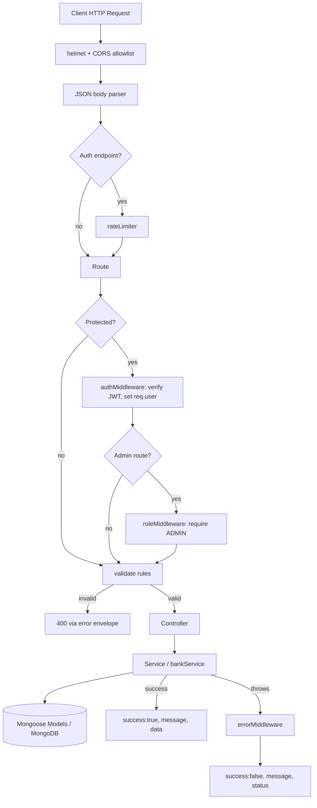
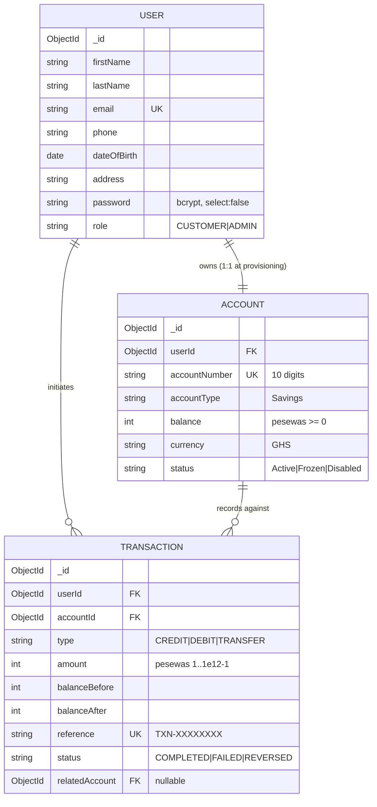
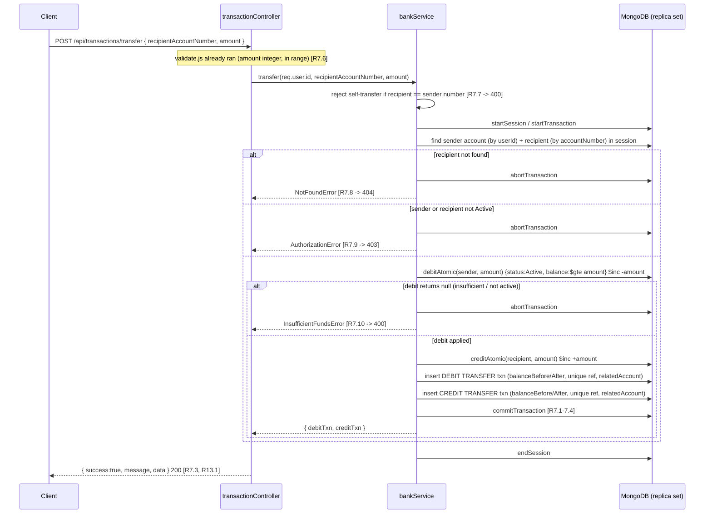

# Design Document

## Overview

This document describes the design of the Banking Backend API: a secure, modular, fully tested Node.js + Express + MongoDB (Mongoose) RESTful service that is the single source of truth for all account balances and transactions. This phase delivers backend only — there are no frontend components.

The service exposes customer-facing operations (registration, authentication, profile overview, deposit, withdrawal, transfer, transaction history, profile management) and administrative operations (customer/account/transaction oversight, aggregate statistics, account status control). It enforces five cross-cutting guarantees that shape every layer of the design:

1. **Monetary integrity** — all money is stored as integer pesewas (100 pesewas = 1 GHS); floating point is never used for balances or amounts. (Requirement 15)
2. **Atomic money movement** — single-account mutations use atomic conditional `$inc` updates; transfers run inside a MongoDB multi-document ACID transaction. (Requirements 6, 7, 15)
3. **Race-condition protection** — conditional atomic updates (`balance $gte amount` + `$inc`) guarantee balances never go negative under concurrency. (Requirements 6.6, 15.4)
4. **Trusted identity** — the acting user is always derived from the verified JWT (`req.user`); client-supplied identity, balance, or amount-ownership fields are never trusted. (Requirement 3)
5. **Standardized responses & layered security** — every response uses the `{ success, message, data }` envelope, a central error handler sanitizes failures, and Helmet/CORS/rate-limiting/RBAC/validation form a defense-in-depth stack. (Requirements 13, 14)

### Technology Choices and Rationale

| Concern | Choice | Rationale |
| --- | --- | --- |
| Runtime/module system | Node.js with ES Modules (`"type": "module"`) | Modern import syntax; aligns with the requested project layout. |
| HTTP framework | Express.js | Mature middleware pipeline model maps cleanly onto the routes → controllers → services layering and the required middleware (auth, role, validation, rate limiting, error handling). |
| ODM | Mongoose | Schema validation, hooks (pre-save password hashing), `select: false` field exclusion, and native session/transaction support. |
| Money representation | Integer pesewas | Avoids IEEE-754 drift; satisfies Requirement 15.1. |
| Auth | JWT (subject claim = userId) + bcryptjs | Stateless auth; `sub` claim is the single identity source (Requirement 3.1); bcrypt satisfies 14.8. |
| Atomic transfer | MongoDB session + ACID transaction | Satisfies Requirement 7; requires a replica set (documented below). |
| Validation | express-validator | Declarative per-route body/query validation and sanitization (Requirements 4, 14.4). |
| Security headers / CORS / rate limit | helmet, cors, express-rate-limit | Satisfies Requirement 14.1–14.3. |
| Testing | Jest + Supertest + mongodb-memory-server (replica set) | In-memory replica set enables transaction-backed integration tests (Requirement 7). |

### Replica Set Requirement (Operational Note)

MongoDB multi-document transactions (required for transfers, Requirement 7) are only available on a replica set, not a standalone `mongod`. For local development this means running MongoDB as a **single-node replica set**. The project README MUST document:

- Starting `mongod` with `--replSet rs0` and running `rs.initiate()` once, **or** using a Docker image preconfigured as a single-node replica set.
- That `mongodb-memory-server` is configured in replica-set mode for the test suite so transfer transactions behave identically in tests.

If transactions are unavailable, the transfer endpoint fails closed (returns an error) rather than performing a non-atomic transfer.

## Architecture

### Layered Architecture

The service follows a strict layered architecture. Each request flows down through the middleware pipeline into a controller, which delegates business logic to a service, which operates on Mongoose models. Responses flow back up through the central response envelope and, on failure, the central error handler.

```
HTTP Request
    │
    ▼
┌───────────────────────────────────────────────────────────────┐
│ Global middleware: helmet → cors(allowlist) → json body parser │
└───────────────────────────────────────────────────────────────┘
    │
    ▼
┌───────────────────────────────────────────────────────────────┐
│ Route layer (authRoutes, accountRoutes, transactionRoutes,     │
│ userRoutes, adminRoutes)                                        │
│   per-route: [rateLimiter] → [authMiddleware] → [roleMiddleware]│
│              → [validate(rules)] → controller                   │
└───────────────────────────────────────────────────────────────┘
    │
    ▼
┌───────────────────────────────────────────────────────────────┐
│ Controller layer (thin): reads req.user, maps req → service     │
│ args, wraps result in { success, message, data }                │
└───────────────────────────────────────────────────────────────┘
    │
    ▼
┌───────────────────────────────────────────────────────────────┐
│ Service layer (authService logic in authController/services,    │
│ bankService): business rules, atomic updates, ACID transfer     │
└───────────────────────────────────────────────────────────────┘
    │
    ▼
┌───────────────────────────────────────────────────────────────┐
│ Model layer (User, Account, Transaction) via Mongoose           │
└───────────────────────────────────────────────────────────────┘
    │
    ▼
MongoDB (replica set)

   Any thrown error ──► errorMiddleware (central Error_Handler)
                        ──► { success:false, message } + status
```

### Request Lifecycle Diagram



### Directory Structure

```
backend/
├── src/
│   ├── config/
│   │   ├── db.js              # Mongoose connection (replica-set aware)
│   │   └── env.js             # Loads & validates environment variables
│   ├── controllers/
│   │   ├── authController.js      # register, login, me  (R1, R2, R4)
│   │   ├── accountController.js    # account overview, profile get/update (R4, R9)
│   │   ├── transactionController.js# deposit, withdraw, transfer, list, getById (R5-R8)
│   │   └── adminController.js       # customers, accounts, transactions, statistics, status (R10-R12)
│   ├── middleware/
│   │   ├── authMiddleware.js   # JWT verify, req.user from sub claim (R3)
│   │   ├── roleMiddleware.js   # RBAC: require ADMIN (R10.1, R12.2, R14)
│   │   ├── errorMiddleware.js  # central Error_Handler (R13)
│   │   ├── rateLimiter.js      # auth endpoint limiter (R14.3)
│   │   └── validate.js         # runs express-validator chains, 400 on failure (R14.4-14.5)
│   ├── models/
│   │   ├── User.js             # User schema (R1, R14.8-14.9)
│   │   ├── Account.js          # Account schema (R1.2, R15.1)
│   │   └── Transaction.js      # Transaction schema (immutable record)
│   ├── routes/
│   │   ├── authRoutes.js       # /api/auth
│   │   ├── accountRoutes.js    # /api/accounts
│   │   ├── transactionRoutes.js# /api/transactions
│   │   ├── userRoutes.js       # /api/users
│   │   └── adminRoutes.js      # /api/admin
│   ├── services/
│   │   └── bankService.js      # reusable business logic: atomic debit/credit, ACID transfer, references
│   ├── utils/
│   │   ├── generateAccountNumber.js  # unique 10-digit account number (R1.2)
│   │   ├── generateReference.js      # unique TXN-XXXXXXXX reference
│   │   ├── formatters.js             # pesewa <-> display GHS formatting (display only)
│   │   └── response.js               # success/error envelope helpers (R13.1)
│   └── server.js               # app assembly, route mounting, error handler, listen
├── tests/
│   ├── auth.test.js
│   ├── transaction.test.js
│   ├── transfer.test.js
│   ├── admin.test.js
│   └── properties/             # property-based tests (see Testing Strategy)
├── seeds/
│   └── seed.js                 # seeds an admin + sample customers/accounts
├── package.json
├── .env.example
└── .gitignore
```

### Separation of Concerns

- **Controllers are thin.** They never contain balance math or transaction orchestration. They read `req.user`, call a service, and shape the response envelope. This keeps the trusted-identity rule (Requirement 3.5/3.6) in one place: the controller passes `req.user.id`, never a client-supplied id.
- **`bankService` is the single owner of money movement.** All balance mutations (deposit credit, withdrawal debit, transfer debit+credit) and all `Transaction` record creation go through `bankService`. This centralizes the monetary invariants of Requirement 15 so they cannot be bypassed or re-implemented inconsistently.
- **Models own schema-level invariants** (field types, ranges, uniqueness, `select:false` on password, index definitions).

## Components and Interfaces

### Configuration (`config/`)

**`env.js`** — Loads environment variables (via `dotenv`) and validates presence/shape at startup: `MONGO_URI`, `JWT_SECRET`, `JWT_EXPIRES_IN` (default 3600s), `PORT`, `CORS_ALLOWLIST` (comma-separated origins), `BCRYPT_ROUNDS`. Fails fast if a required secret is missing. The `JWT_SECRET` is never logged (Requirement 13.3).

**`db.js`** — Establishes the Mongoose connection and exposes a `connectDB()` function. Logs connection state without secrets. The connection string targets a replica set so sessions/transactions are available (Requirement 7).

### Middleware (`middleware/`)

**`authMiddleware.js` (Auth_Middleware)** — Reads the `Authorization: Bearer <token>` header. Verifies the JWT with `JWT_SECRET`. On success, resolves the user from the token's `sub` (subject) claim and attaches a minimal identity to `req.user` (`{ id, role }`). Passes control to the next handler. (Requirement 3.1)
- Missing token → 401 "Authentication required / missing token" (3.2)
- Expired token → 401 "Token expired" (3.3)
- Malformed/invalid token → 401 "Invalid token" (3.4)
- It never reads identity from the body/query. (3.5, 3.6)

**`roleMiddleware.js` (Role_Middleware)** — A factory `requireRole('ADMIN')` that runs after `authMiddleware`. If `req.user.role !== 'ADMIN'`, rejects with 403 "insufficient privileges" before the controller runs. (Requirements 10.1, 12.2)

**`validate.js` (Validation_Middleware)** — A middleware that executes the express-validator chains supplied for a route, then checks `validationResult`. If there are errors, it short-circuits with 400 and a message listing which fields failed, and never calls the controller. (Requirements 1.4, 2.3, 5.3, 6.4, 7.6, 8.4/8.7, 9.5, 12.4, 14.4, 14.5) Validation chains also **sanitize** (trim, normalize email, toInt on amounts) so controllers receive typed, clean input.

**`rateLimiter.js` (Rate_Limiter)** — Two concerns:
- An IP-based `express-rate-limit` of 5 requests per 15-minute window on auth endpoints → 429. (Requirement 14.3)
- An email-based login throttle: 5 consecutive failed logins for the same email within 300s triggers a 900s lockout returning 429, while leaving the User record unchanged. (Requirement 2.4) This is tracked in an in-memory store keyed by normalized email (documented as process-local; a shared store such as Redis would be used in a multi-instance deployment).

**`errorMiddleware.js` (Error_Handler)** — The terminal Express error handler `(err, req, res, next)`. Maps known error shapes to statuses in `{400,401,403,404,409,429,500}`, returns `{ success:false, message }` with no `data` field, strips stack traces from the body (Requirement 13.4), and ensures password hashes, JWTs, and the signing secret never appear in the body or logs (Requirement 13.3). Unknown errors become 500.

### Controllers (`controllers/`)

Controllers translate HTTP ↔ service calls and apply the response envelope. All identity comes from `req.user`.

**`authController.js`**
- `register(req,res)` → validates already done; calls registration logic that creates User + linked Account (atomically; see below), returns 201 with safe user + account. (R1)
- `login(req,res)` → verifies credentials, issues JWT (`sub=userId`, exp 3600s), returns safe payload. (R2)
- `me(req,res)` → returns authenticated profile (password omitted) + account overview. (R4.1, R4.2)

**`accountController.js`**
- `getAccount(req,res)` → account details for `req.user.id` (accountNumber, balance, currency, accountType, status); 404 if none. (R4.3, R4.4)
- `getProfile(req,res)` → user profile without password. (R9.1, R9.2)
- `updateProfile(req,res)` → updates only `phone` and `address`; ignores `balance`, `accountNumber`, `role`, `email`. (R9.3, R9.4, R9.5)

**`transactionController.js`**
- `deposit` → `bankService.deposit(userId, amount)` (R5)
- `withdraw` → `bankService.withdraw(userId, amount)` (R6)
- `transfer` → `bankService.transfer(userId, recipientAccountNumber, amount)` (R7)
- `list` → `bankService.listTransactions(userId, filters)` with pagination/type/date/search (R8.1–8.9)
- `getById` → returns a single transaction only if owned by `req.user` else 404 (R8.10, R8.11)

**`adminController.js`** (all behind `authMiddleware` + `requireRole('ADMIN')`)
- `listCustomers` (R10.2, R10.3, R10.4)
- `listAccounts` (R10.5)
- `listTransactions` (R10.6)
- `statistics` (R11)
- `updateAccountStatus` (R12)

### Services (`services/`) — `bankService` (Bank_Service)

`bankService` is the reusable business-logic core. Interface (conceptual):

```js
// All amounts are integer pesewas. userId always originates from req.user.
bankService.deposit(userId, amount) -> { account, transaction }
bankService.withdraw(userId, amount) -> { account, transaction }
bankService.transfer(userId, recipientAccountNumber, amount) -> { debitTxn, creditTxn }
bankService.listTransactions(userId, { page, limit, type, startDate, endDate, search }) -> { items, total, page, limit }
bankService.getTransactionForUser(userId, txnId) -> transaction | null
```

Key internal mechanics:

- **`creditAtomic(accountId, amount, session?)`** — `Account.findOneAndUpdate({ _id, status:'Active' }, { $inc:{ balance: amount } }, { new:true })`. Returns the updated doc or null (null = not found / not Active). (Requirements 5.1, 15.2)
- **`debitAtomic(accountId, amount, session?)`** — `Account.findOneAndUpdate({ _id, status:'Active', balance:{ $gte: amount } }, { $inc:{ balance: -amount } }, { new:true })`. A null result means insufficient funds or non-active status; the balance was NOT changed. This single conditional update is the race-condition and double-spend guard. (Requirements 6.1, 6.3, 6.6, 15.4)
- **Reference + balanceBefore/balanceAfter** — Because `findOneAndUpdate({new:true})` returns the post-update balance, `balanceAfter` is read from the returned doc and `balanceBefore = balanceAfter ∓ amount`. (Requirement 15.3)
- **Status gate** — The `status:'Active'` condition in the atomic filter enforces that Frozen/Disabled accounts reject deposits/withdrawals/transfers (Requirements 5.4, 6.5, 7.9, 12.5) at the same instant the balance check happens, with no separate read-then-write window.

### Routes (`routes/`) — API Surface

| Method & Path | Middleware | Controller | Requirements |
| --- | --- | --- | --- |
| `POST /api/auth/register` | rateLimiter, validate | authController.register | R1, R14.3 |
| `POST /api/auth/login` | rateLimiter, validate | authController.login | R2, R14.3 |
| `GET /api/auth/me` | auth | authController.me | R4.1, R4.2 |
| `GET /api/accounts/me` | auth | accountController.getAccount | R4.3, R4.4 |
| `GET /api/users/me` | auth | accountController.getProfile | R9.1, R9.2 |
| `PUT /api/users/me` | auth, validate | accountController.updateProfile | R9.3–R9.5 |
| `POST /api/transactions/deposit` | auth, validate | transactionController.deposit | R5 |
| `POST /api/transactions/withdraw` | auth, validate | transactionController.withdraw | R6 |
| `POST /api/transactions/transfer` | auth, validate | transactionController.transfer | R7 |
| `GET /api/transactions` | auth, validate(query) | transactionController.list | R8.1–R8.9 |
| `GET /api/transactions/:id` | auth | transactionController.getById | R8.10, R8.11 |
| `GET /api/admin/customers` | auth, requireRole(ADMIN), validate(query) | adminController.listCustomers | R10.1–R10.4 |
| `GET /api/admin/accounts` | auth, requireRole(ADMIN), validate(query) | adminController.listAccounts | R10.5 |
| `GET /api/admin/transactions` | auth, requireRole(ADMIN), validate(query) | adminController.listTransactions | R10.6 |
| `GET /api/admin/statistics` | auth, requireRole(ADMIN) | adminController.statistics | R11 |
| `PUT /api/admin/accounts/:id/status` | auth, requireRole(ADMIN), validate | adminController.updateAccountStatus | R12 |

### Utilities (`utils/`)

- **`generateAccountNumber.js`** — Produces a 10-digit numeric string; retries on uniqueness collision against the Account collection until unique. (R1.2)
- **`generateReference.js`** — Produces `TXN-XXXXXXXX` (8 uppercase base36/hex chars); unique across Transactions. Collisions retry.
- **`formatters.js`** — `pesewasToDisplay(pesewas) -> "GHS 1,234.56"` and `displayToPesewas(string) -> integer`. **Display/parsing only** — never used in balance arithmetic. All stored/compared values remain integer pesewas. (R15.1)
- **`response.js`** — `ok(res, status, message, data)` and the error path feeding `errorMiddleware`, enforcing the `{success,message,data}` shape. (R13.1)

## Data Models

All monetary fields are **integer pesewas**. Mongoose schemas enforce ranges and the custom integer validation.

### User Model (`models/User.js`)

```js
const userSchema = new mongoose.Schema({
  firstName:   { type: String, required: true, trim: true, minlength: 1, maxlength: 50 },
  lastName:    { type: String, required: true, trim: true, minlength: 1, maxlength: 50 },
  email:       { type: String, required: true, unique: true, lowercase: true, trim: true,
                 maxlength: 254, index: true },
  phone:       { type: String, required: true, trim: true },      // digits-only validated at edge
  dateOfBirth: { type: Date,   required: true },                   // age >= 18 validated at edge
  address:     { type: String, required: true, trim: true, minlength: 1, maxlength: 255 },
  password:    { type: String, required: true, select: false },    // bcrypt hash; excluded by default
  role:        { type: String, enum: ['CUSTOMER','ADMIN'], default: 'CUSTOMER', index: true },
}, { timestamps: true });

// Pre-save hook: hash password with bcryptjs when modified.
userSchema.pre('save', async function () {
  if (this.isModified('password')) this.password = await bcrypt.hash(this.password, rounds);
});
// Instance method for login verification.
userSchema.methods.comparePassword = function (candidate) {
  return bcrypt.compare(candidate, this.password);
};
```

- `email` is unique + lowercased + indexed → enforces Requirement 1.3 (409 on duplicate) and fast login lookup.
- `password` has `select:false` → excluded from all queries by default (Requirement 14.9); login explicitly re-selects it with `.select('+password')`.
- Stored only as a bcrypt hash (Requirements 1.1, 14.8).
- `role` defaults to `CUSTOMER` (Requirement 1.1).

### Account Model (`models/Account.js`)

```js
const accountSchema = new mongoose.Schema({
  userId:        { type: ObjectId, ref: 'User', required: true, index: true },
  accountNumber: { type: String, required: true, unique: true, index: true,
                   match: /^\d{10}$/ },                         // exactly 10 digits
  accountType:   { type: String, default: 'Savings' },
  balance:       { type: Number, default: 0, min: 0, max: 9_999_999_999_999,
                   validate: Number.isInteger },                // integer pesewas (R15.1)
  currency:      { type: String, default: 'GHS' },
  status:        { type: String, enum: ['Active','Frozen','Disabled'], default: 'Active', index: true },
}, { timestamps: true });
```

- `balance` is an integer in `[0, 9_999_999_999_999]` pesewas (Requirement 15.1); schema `min:0` is a defense-in-depth backstop while the atomic conditional update is the primary non-negativity guard.
- `accountNumber` unique + indexed → fast recipient lookup for transfers and uniqueness for provisioning (R1.2).
- `userId` indexed → fast "my account" lookups.
- `status` drives the Active/Frozen/Disabled gate (Requirement 12.5).

### Transaction Model (`models/Transaction.js`)

```js
const transactionSchema = new mongoose.Schema({
  userId:        { type: ObjectId, ref: 'User', required: true, index: true },
  accountId:     { type: ObjectId, ref: 'Account', required: true, index: true },
  type:          { type: String, enum: ['CREDIT','DEBIT','TRANSFER'], required: true },
  amount:        { type: Number, required: true, min: 1, max: 999_999_999_999,
                   validate: Number.isInteger },                 // integer pesewas (R15.1)
  balanceBefore: { type: Number, required: true, min: 0, validate: Number.isInteger },
  balanceAfter:  { type: Number, required: true, min: 0, validate: Number.isInteger },
  description:   { type: String, default: '', maxlength: 255 },
  reference:     { type: String, required: true, unique: true, match: /^TXN-[A-Z0-9]{8}$/ },
  status:        { type: String, enum: ['COMPLETED','FAILED','REVERSED'], required: true },
  relatedAccount:{ type: ObjectId, ref: 'Account' },             // counterparty for transfers
}, { timestamps: true });

// Compound index for history queries: a user's transactions newest-first.
transactionSchema.index({ userId: 1, createdAt: -1 });
// Supporting indexes for filtered history.
transactionSchema.index({ userId: 1, type: 1, createdAt: -1 });
```

- `reference` unique → audit-trail integrity and the uniqueness invariant (R5.2, R6.2, R7.4).
- `amount` integer in `[1, 999_999_999_999]` (R15.1).
- Transactions are treated as **immutable** append-only records; no update path mutates an existing transaction's monetary fields.
- `{ userId:1, createdAt:-1 }` compound index serves the default descending history query (R8.1) and ownership-scoped lookups (R8.11).

### Entity Relationship Diagram



## Money and Precision Strategy

This section consolidates the monetary design (Requirement 15) because it crosses several components.

1. **Representation.** Every balance and every amount is an integer number of pesewas. 1 GHS = 100 pesewas. Balances range `[0, 9_999_999_999_999]`; amounts range `[1, 999_999_999_999]`. Schema validators assert `Number.isInteger` and the min/max bounds. (R15.1)
2. **No floating point in arithmetic.** All additions/subtractions are integer operations performed by MongoDB's `$inc`. The `formatters.js` util converts to/from a human display string, but conversion output is never fed back into balance math. (R15.1)
3. **Atomic increments.** Balance changes are applied with `$inc` inside a `findOneAndUpdate`, never a read-modify-write in application code, so concurrent operations cannot overwrite each other. (R15.2)
4. **balanceAfter identity.** For every operation, `balanceAfter = balanceBefore + signedAmount` where `signedAmount = +amount` for credits and `-amount` for debits. The service records the post-update balance from the returned document and derives `balanceBefore` consistently. (R15.3)
5. **Conditional debit (double-spend guard).** Debits (withdrawal + transfer-debit) use the filter `{ balance: { $gte: amount }, status: 'Active' }`. The update applies only if the condition still holds at write time, so two concurrent debits cannot both succeed past the available balance, and balance never goes negative. (R15.4, R6.6)
6. **Validation + insufficient funds.** Amount validation (positive integer in range) happens in `validate.js` before any balance change (R15.5). A debit whose condition fails is reported as insufficient funds with no balance change (R15.6).

## Correctness Properties

*A property is a characteristic or behavior that should hold true across all valid executions of a system — essentially, a formal statement about what the system should do. Properties serve as the bridge between human-readable specifications and machine-verifiable correctness guarantees.*

The following properties are derived from the acceptance-criteria prework and consolidated to remove redundancy. Each is universally quantified and maps back to the requirements it validates. These drive the property-based tests described in the Testing Strategy.

### Property 1: Ledger balanceAfter identity

*For any* deposit, withdrawal, or transfer transaction record produced by the system, `balanceAfter == balanceBefore + signedAmount`, where `signedAmount = +amount` for a CREDIT effect and `-amount` for a DEBIT effect.

**Validates: Requirements 5.2, 6.2, 7.4, 15.3**

### Property 2: Deposit effect

*For any* Active account and valid integer amount, after a successful deposit the account balance equals the prior balance plus the amount, and exactly one COMPLETED CREDIT transaction is recorded for that account.

**Validates: Requirements 5.1, 5.2**

### Property 3: Withdrawal effect and non-negativity

*For any* Active account whose balance is greater than or equal to a valid amount, after a successful withdrawal the balance equals the prior balance minus the amount and is never negative, and exactly one COMPLETED DEBIT transaction is recorded.

**Validates: Requirements 6.1, 6.2, 15.3**

### Property 4: Concurrency and double-spend safety

*For any* account with an initial balance and *any* set of concurrent withdrawal/transfer-debit requests, the final balance is never negative and the sum of all successfully applied debits is less than or equal to the initial balance (conservation under concurrency).

**Validates: Requirements 6.6, 15.2, 15.4**

### Property 5: Successful transfer conserves money

*For any* valid transfer between two distinct Active accounts where the sender balance is greater than or equal to the amount, after commit the sender balance decreases by the amount, the recipient balance increases by the same amount, and the combined balance of the two accounts is unchanged. Exactly two TRANSFER transactions are recorded (a DEBIT effect for the sender and a CREDIT effect for the recipient), each referencing the counterparty via `relatedAccount`.

**Validates: Requirements 7.1, 7.2, 7.3, 7.4**

### Property 6: Failed transfer atomicity

*For any* transfer that fails at any point after the session transaction begins (including insufficient funds, a non-Active party, or an injected mid-operation failure), both the sender and recipient balances remain exactly equal to their pre-transfer values and no COMPLETED transfer transactions persist.

**Validates: Requirements 7.5, 7.10, 15.6**

### Property 7: Non-active accounts reject money movement

*For any* account whose status is Frozen or Disabled, every deposit, withdrawal, or transfer (with that account as sender or recipient) is rejected and leaves all affected balances unchanged with no COMPLETED transaction recorded.

**Validates: Requirements 5.4, 6.5, 7.9, 12.5**

### Property 8: Transaction reference uniqueness

*For any* sequence of successful money operations, every created transaction has a `reference` matching `TXN-[A-Z0-9]{8}` that is unique across all transactions in the system.

**Validates: Requirements 5.2, 6.2, 7.4**

### Property 9: Invalid amount rejected without side effects

*For any* deposit, withdrawal, or transfer amount that is not a positive integer within `[1, 999_999_999_999]` pesewas, the request is rejected with HTTP 400 and all affected account balances remain unchanged.

**Validates: Requirements 5.3, 6.4, 7.6, 15.5**

### Property 10: Insufficient funds rejected without side effects

*For any* withdrawal or transfer whose amount exceeds the available sender balance, the request is rejected with HTTP 400 (insufficient funds) and all affected balances remain unchanged.

**Validates: Requirements 6.3, 7.10, 15.6**

### Property 11: Monetary values are integers within range

*For any* reachable system state produced by a sequence of operations, every stored account balance is an integer in `[0, 9_999_999_999_999]` and every stored transaction amount is an integer in `[1, 999_999_999_999]` pesewas.

**Validates: Requirements 15.1**

### Property 12: Trusted identity — client-supplied identity is ignored

*For any* authenticated balance-changing or profile-update request that also includes spoofed `userId`, `accountId`, `balance`, `accountNumber`, `role`, or `email` fields in the body, the operation affects only the account/profile owned by `req.user` (resolved from the JWT subject claim) and the spoofed fields have no effect on stored data.

**Validates: Requirements 3.1, 3.5, 3.6, 9.4**

### Property 13: Invalid or missing token rejected

*For any* protected endpoint and *any* request whose token is missing, expired, malformed, or has an invalid signature, the request is rejected with HTTP 401 before the handler executes and no state change occurs.

**Validates: Requirements 3.2, 3.3, 3.4**

### Property 14: Data ownership isolation

*For any* customer and *any* account, transaction, or profile data returned to them, every returned record is owned by that customer; and *for any* attempt by a customer to read or fetch a specific record owned by another user, the response is HTTP 403 or 404 and no foreign data is returned.

**Validates: Requirements 8.1, 8.11, 14.6, 14.7**

### Property 15: Admin authorization

*For any* admin endpoint and *any* authenticated non-ADMIN user, the request is rejected with HTTP 403 and no customer, account, transaction, or statistics data is returned.

**Validates: Requirements 10.1, 11.3, 12.2**

### Property 16: Pagination correctness

*For any* list endpoint (customer history, admin customers/accounts/transactions), *any* dataset, and *any* valid `page`/`limit` within range (page ≥ 1, limit 1–100), the returned slice equals the expected slice of the deterministically ordered result set, and the response includes a correct total count, current page, and page size; absent parameters default to page 1 and size 20.

**Validates: Requirements 8.2, 8.3, 10.2, 10.5, 10.6**

### Property 17: History filter soundness and completeness

*For any* transaction-history query over an owned dataset: a `type` filter returns exactly the owned transactions of that type; a valid `startDate`/`endDate` range returns exactly the owned transactions whose creation timestamp falls inclusively within the range; and a `search` term returns exactly the owned transactions whose `description` or `reference` contains the term as a case-insensitive substring (no match omitted, no non-match included).

**Validates: Requirements 8.5, 8.6, 8.8**

### Property 18: Statistics aggregation correctness

*For any* dataset, the admin statistics response reports `System_Liquidity` equal to the independently computed sum of all account balances, and Total Customers, Total Accounts, Total Deposits, Total Withdrawals, and Total Transfers each equal to the independently computed count, with every total an integer greater than or equal to 0.

**Validates: Requirements 11.1, 11.5**

### Property 19: Account status update is deterministic and idempotent

*For any* existing account and *any* valid target status (Active, Frozen, Disabled), an admin status update sets the stored status to the target and the response reflects it; applying the same status update a second time leaves the stored status unchanged.

**Validates: Requirements 12.1**

### Property 20: Resource-not-found handling

*For any* status update referencing a nonexistent account id, *any* transfer to a nonexistent recipient account number, and *any* fetch of a transaction id not owned by the requester, the response is HTTP 404 and no state change occurs.

**Validates: Requirements 7.8, 8.11, 12.3**

### Property 21: Response envelope consistency

*For any* successful request, the response body is exactly `{ success: true, message, data }`; *for any* failing request, the response body is exactly `{ success: false, message }` with no `data` field and an HTTP status drawn from `{400, 401, 403, 404, 409, 429, 500}`.

**Validates: Requirements 13.1, 13.2**

### Property 22: No secret leakage

*For any* response body produced by any endpoint, the body never contains a password, a password (bcrypt) hash, a JWT value, the JWT signing secret, or a stack trace; and the password field is absent from any user object returned by a default query.

**Validates: Requirements 13.3, 13.4, 14.8, 14.9**

## Error Handling

### Central Error Handler (Error_Handler)

All route handlers are wrapped so thrown errors propagate to the terminal `errorMiddleware`. The service and controller layers throw typed application errors; `errorMiddleware` maps them to the standardized error envelope.

**Error taxonomy → HTTP status:**

| Error type | Status | Example trigger | Requirement |
| --- | --- | --- | --- |
| `ValidationError` | 400 | Invalid field, invalid amount, invalid pagination/date | 1.4, 2.3, 5.3, 6.4, 7.6, 8.4, 8.7, 9.5, 10.4, 12.4, 14.5, 15.5 |
| `AuthenticationError` | 401 | Missing/expired/invalid token, bad credentials | 2.2, 3.2, 3.3, 3.4, 4.2, 9.2 |
| `AuthorizationError` | 403 | Non-admin on admin route; frozen/disabled account op; cross-user access | 5.4, 6.5, 7.9, 10.1, 12.2, 12.5, 14.7 |
| `NotFoundError` | 404 | No account; unknown recipient; unowned/nonexistent transaction; unknown account id | 4.4, 7.8, 8.11, 12.3 |
| `ConflictError` | 409 | Duplicate email on registration | 1.3 |
| `RateLimitError` | 429 | Auth rate limit / login lockout | 2.4, 14.3 |
| `InsufficientFundsError` | 400 | Withdraw/transfer amount > balance | 6.3, 7.10, 15.6 |
| Unknown / unhandled | 500 | Unexpected failure, transaction/replica-set unavailable, rollback | 1.6, 5.5, 11.4, 13.4 |

**Guarantees enforced by the handler:**

- The response body is always `{ success: false, message }` with no `data` field. (Requirement 13.2)
- Stack traces are never placed in the response body; they may be logged server-side only with secrets stripped. (Requirement 13.4)
- Passwords, bcrypt hashes, JWTs, and the signing secret are never written to the body or logs. The handler sanitizes error payloads before logging. (Requirement 13.3)
- Unknown error shapes default to 500. (Requirement 13.4)

### Registration Rollback (Requirement 1.6)

Registration creates a User and then a linked Account. To guarantee no orphaned User if account creation fails, registration runs inside a MongoDB session transaction (same replica-set facility used by transfers): both inserts commit together or the transaction aborts and neither persists. On abort, the handler returns 500 "registration could not be completed." This gives the atomic "exactly one account per user, or nothing" guarantee of Requirements 1.2 and 1.6.

### Transfer Failure Handling (Requirement 7.5)

The transfer flow wraps the debit, credit, and both transaction inserts in a single session transaction. Any thrown error (insufficient funds detected by the conditional debit returning null, a non-active party, a write failure, or replica-set unavailability) triggers `abortTransaction()`, leaving both balances untouched (Property 6). The outer controller then maps the specific cause to its status (400/403/404/500).

### Atomic Transfer Flow (Sequence)



## Testing Strategy

### Overview and Rationale

The core of this service is business logic with strong universal invariants — integer money arithmetic, non-negativity under concurrency, conservation across transfers, reference uniqueness, data-ownership isolation, and response-envelope consistency. These are exactly the conditions where **property-based testing** adds the most value, so PBT is appropriate here and is used for the invariants captured in Properties 1–22. Pure HTTP wiring, security headers, and specific empty/failure scenarios are covered by example-based and integration tests.

The suite uses **Jest + Supertest + mongodb-memory-server** configured as a **single-node replica set**, so transaction-backed transfers and registration rollback execute identically to production. Each test run starts a fresh in-memory replica set and clears collections between tests for isolation.

### Dual Testing Approach

- **Property-based tests** (library: `fast-check` for the JS/Jest ecosystem) verify universal properties across generated inputs. We do NOT implement property testing from scratch.
  - Minimum **100 iterations** per property test (`fc.assert(..., { numRuns: 100 })`).
  - Each property test is tagged with a comment referencing the design property, in the format:
    `// Feature: banking-backend-api, Property {number}: {property_text}`
  - Each correctness property (Properties 1–22) is implemented by a **single** property-based test.
- **Example-based unit/integration tests** cover specific scenarios and edge cases that are not universal:
  - Registration rollback on account-creation failure (R1.6, EDGE_CASE) via mocked failure.
  - Deposit increment persistence failure → 500 (R5.5, EDGE_CASE) via mock.
  - Login lockout after 5 failures / 429 and auth rate limiting (R2.4, R14.3, EXAMPLE) with controlled timing.
  - Empty transaction history → 200 empty set, total 0 (R8.9, EXAMPLE).
  - Statistics on empty collections → zeros (R11.5, EDGE_CASE) and aggregation failure → error (R11.4, EDGE_CASE).
  - No-account-for-user → 404 (R4.4, EDGE_CASE).
  - Latency expectations (R1.5, R2.1, R6.1, R9.1, R9.3, R11.2) measured as example assertions, not property-asserted, since latency is environment-dependent.

### Property → Test Generators

| Property | Generators / approach |
| --- | --- |
| 1 Ledger identity | random op sequences (deposit/withdraw/transfer); assert `balanceAfter == balanceBefore ± amount` on every txn |
| 2 Deposit effect | random Active account + valid amount |
| 3 Withdraw effect | random account with `balance ≥ amount` |
| 4 Concurrency | one account + N concurrent debits (`Promise.all`); assert final ≥ 0 and conservation |
| 5 Transfer conservation | two distinct Active accounts + amount ≤ sender balance |
| 6 Transfer atomicity | failure injection after debit; assert both balances unchanged |
| 7 Status gate | account status ∈ {Frozen, Disabled} × {deposit, withdraw, transfer} |
| 8 Reference uniqueness | random op sequence; assert set of references has no duplicates and matches regex |
| 9 Invalid amount | amounts ∈ {≤0, non-integer, > max} |
| 10 Insufficient funds | amount > balance |
| 11 Integer range invariant | random op sequences; assert `Number.isInteger` + bounds on all stored money |
| 12 Trusted identity | valid request body augmented with spoofed userId/accountId/balance/role/email |
| 13 Invalid token | tokens: missing, expired (past exp), bad signature, random garbage |
| 14 Ownership isolation | multi-user dataset; per-user reads + cross-user fetch attempts |
| 15 Admin RBAC | customer tokens × all admin routes |
| 16 Pagination | random dataset size × random valid page/limit |
| 17 Filters | random type/date-range/search over seeded owned txns |
| 18 Statistics | random dataset; compare aggregation output to independent JS computation (model-based) |
| 19 Status idempotence | random valid status applied once and twice |
| 20 Not found | nonexistent ids / account numbers |
| 21 Envelope | random valid and invalid requests across endpoints |
| 22 Secret leak | scan all response bodies for forbidden fields/substrings |

### Integration Test Flows (Supertest, example-based)

- **Auth flow**: register → login → access `/api/auth/me` with the token; assert envelope, token exp 3600, no password leakage.
- **Transaction flow**: deposit → withdraw → history; assert balances and ledger records.
- **Transfer flow**: two users, transfer, assert conservation and both transaction records within a committed transaction; assert abort leaves balances unchanged on forced failure.
- **Admin flow**: admin lists customers/accounts/transactions, reads statistics, freezes an account, then asserts a subsequent transaction on that account is rejected (R12.5).

### Security-Specific Tests

- Helmet headers present on responses (R14.1) — asserted across a sample of endpoints (Property-style presence check).
- CORS allowlist accepts allowlisted origins and denies others (R14.2).
- Auth rate limiter returns 429 past the window (R14.3).

### Seed Data

`seeds/seed.js` provisions one ADMIN user and several CUSTOMER users with accounts and sample transactions, enabling manual testing and a known baseline for admin-list/statistics checks. Seed money values are integer pesewas consistent with Requirement 15.1.

## Requirements Traceability Summary

- **R1 Registration/provisioning** → authController.register, User/Account models, session-transaction rollback, Properties 2(indirect), 11, 22; EDGE 1.6.
- **R2 Authentication** → authController.login, rateLimiter (lockout), JWT issuance; Properties 13, 22; EXAMPLE 2.4.
- **R3 Trusted identity** → authMiddleware, controllers reading `req.user`; Properties 12, 13.
- **R4 Profile/account overview** → authController.me, accountController.getAccount; Property 14; EDGE 4.4.
- **R5 Deposit** → bankService.deposit, creditAtomic; Properties 1, 2, 7, 8, 9, 21; EDGE 5.5.
- **R6 Withdraw** → bankService.withdraw, debitAtomic; Properties 1, 3, 4, 7, 9, 10.
- **R7 Transfer** → bankService.transfer (session transaction); Properties 1, 5, 6, 7, 8, 9, 10, 20.
- **R8 History** → bankService.listTransactions, transactionController.getById; Properties 14, 16, 17, 20; EXAMPLE 8.9.
- **R9 Profile management** → accountController.getProfile/updateProfile; Properties 12, 14, 22.
- **R10 Admin oversight** → adminController lists, roleMiddleware; Properties 15, 16.
- **R11 Admin statistics** → adminController.statistics (aggregation); Property 18; EDGE 11.4, 11.5.
- **R12 Account status control** → adminController.updateAccountStatus; Properties 7, 15, 19, 20.
- **R13 Standardized responses/errors** → response.js, errorMiddleware; Properties 21, 22.
- **R14 Security controls** → helmet, cors, rateLimiter, validate, roleMiddleware, User model; Properties 13, 14, 15, 22; EXAMPLE 14.3; security tests.
- **R15 Monetary precision** → integer pesewas, $inc, conditional debit, bankService; Properties 1, 4, 9, 10, 11.
